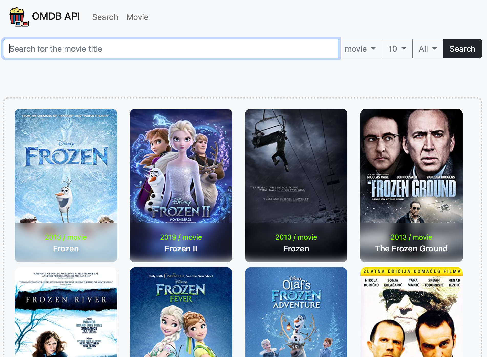

# 배포주소

배포: https://hwisaac.github.io/KDT3-M2-MovieAPI/

## 사용

- html/css/js
- bootstrap

## 요구사항

### :exclamation: 필수

- [x] 영화 제목으로 검색 가능하고 검색된 결과의 영화 목록이 출력돼야 합니다.
- [x] jQuery, React, Vue 등 JS 라이브러리와 프레임워크는 사용하지 않아야 합니다.
- [x] 스타일(CSS) 라이브러리나 프레임워크 사용은 자유입니다. -> 부트스트랩 사용
- [x] 실제 서비스로 배포하고 접근 가능한 링크를 추가해야 합니다.

### :grey_question: 선택

- [x] 한 번의 검색으로 영화 목록이 20개 이상 검색되도록 만들어보세요.
- [x] 영화 개봉연도로 검색할 수 있도록 만들어보세요.
- [x] 영화 목록을 검색하는 동안 로딩 애니메이션이 보이도록 만들어보세요. -> More 버튼 로딩으로 대체
- [x] 무한 스크롤 기능을 추가해서 추가 영화 목록을 볼 수 있도록 만들어보세요.
- [x] 영화 포스터가 없을 경우 대체 이미지를 출력하도록 만들어보세요.
- [x] 단일 영화의 상세정보(제목, 개봉연도, 평점, 장르, 감독, 배우, 줄거리, 포스터 등)를 볼 수 있도록 만들어보세요.
- [x] 영화 상세정보가 출력되기 전에 로딩 애니메이션이 보이도록 만들어보세요.
- [x] 영화 상세정보 포스터를 고해상도로 출력해보세요.(실시간 이미지 리사이징)
- [x] 차별화가 가능하도록 프로젝트를 최대한 예쁘게 만들어보세요.

## 구현된 기능들
 - https://stupefied-hodgkin-d9d350.netlify.app/#/ 완성예시 페이지를 참고하였습니다.
 - SPA 입니다. 주소 해시값이 바뀌면 화면 페이지를 전부 리셋하고 새로 랜더링 하는 구조입니다.
 - 페이지는 총 두개입니다. 검색하는 페이지 Search 와 상세정보 페이지 Movie 페이지입니다.
 - 검색 옵션은 타입(movie, series, episode) , 검색 갯수(10,20,30), 개봉년도(2022~) 세가지 입니다.
 - 검색시 하단에 More 버튼이 나타나고 More 버튼을 누를 때마다 10개 페이지를 추가로 보여줍니다.
 - 스크롤을 최하단으로 내리면 More 버튼이 자동으로 작동하여 10개 페이지를 추가로 보여주며 무한 스크롤이 됩니다.
 - More 기능이 작동하여 페이지를 불러올때마다 More 버튼에 로딩 애니메이션이 나타납니다.
 - 검색된 영화 목록의 행의 포스터 개수는 가로 너비에 따라 반응형으로 정해집니다.
 - 상세페이지와 영화 검색목록에서 이미지가 없을 경우 대체 이미지를 삽입합니다.
 - 검색 할 때마다 같은 검색이어도 검색한 시간에 따라 해시주소를 변경시켜 사용성을 향상했습니다.
 - 상세페이지의 가로 너비가 줄어들면 요소가 세로로 쌓입니다.
 - 상세페이지를 불러오는 도중에 스켈레톤 UI 와 로딩 애니메이션이 표시됩니다.

## 신경쓴 부분

- js 모듈화 (망함)
- 전역변수 추적하기가 너무 어려워서 최대한 줄이고자 했음
- 유지보수가 쉬운 코드를 작성하고자 함

### 어려웠던 점

- 모듈화 할 때마다 에러랑 싸우는 것
- 코드 양이 많아질 수록 버그 수정하기가 힘들어서 엄두가 안남
- 해시로 싱글페이지로 구현하다보니 뒤로가기나, 검색, 페이지 전환 등 사용감이 안좋았음
  - 이를 줄이기 위해 많은 해쉬값 주소와 그에 대응하는 조건문 분기를 만들어야 했음
- 주요 함수는 모듈화 하고 main 에서 그걸 불러와서 교통정리하고 싶었지만 이 파일 저 파일 각종 변수나 함수를 import 하는 통에 스파게티 코드가 된 것 같음

## 레퍼런스
-  https://stupefied-hodgkin-d9d350.netlify.app/#/
- 전반적인 기능 및 디자인, 부트스트랩 사용법, 로딩 애니메이션, 스켈레톤UI 등
  - 핀테크 서비스 권장강의>영화검색사이트 예제
- 무한스크롤
  - https://heropy.blog/2019/10/27/intersection-observer/
- 해시 사용법
  - 김민태의 프론트엔드 아카데미
  - https://github.com/KDT1-FE/KDT3-Theory-JS/blob/main/WebAPI.md#history
